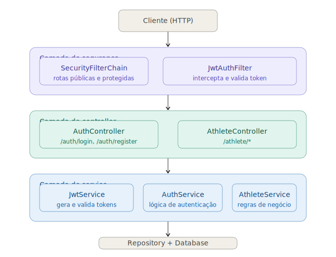
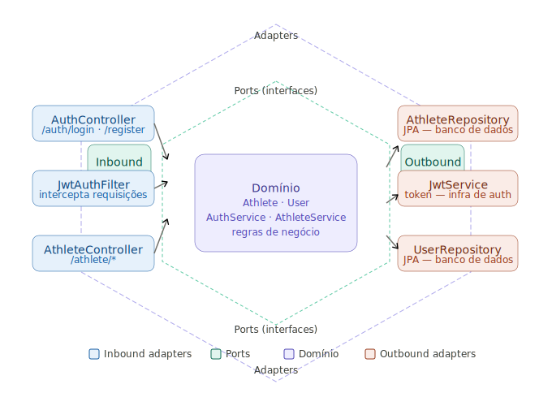

# 🏋️ Microservice Register Athlete

API REST para cadastro e autenticação de atletas, construída com Java 11 + Spring Boot + JWT.

---

## 📋 Índice

- [Tecnologias](#tecnologias)
- [Rodando localmente](#rodando-localmente)
- [Docker](#docker)
- [Kubernetes com Minikube](#kubernetes-com-minikube)
- [SonarQube](#sonarqube)
- [Endpoints](#endpoints)

---

## Tecnologias

- Java 11
- Spring Boot
- Spring Security + JWT
- Maven
- Docker
- Kubernetes (Minikube)
- SonarQube

---

## Rodando localmente

```bash
# Clone o repositório
git clone https://github.com/Danielpernnasc/microsserviceRegisterAthlete.git
cd microsserviceRegisterAthlete
git checkout finalizacao

# Build e execução
./mvnw spring-boot:run
```

A API estará disponível em `http://localhost:8080`

---

## Docker

### Dockerfile

Crie um `Dockerfile` na raiz do projeto:

```dockerfile
FROM eclipse-temurin:11-jdk-alpine AS build
WORKDIR /app
COPY . .
RUN ./mvnw clean package -DskipTests

FROM eclipse-temurin:11-jre-alpine
WORKDIR /app
COPY --from=build /app/target/*.jar app.jar
EXPOSE 8080
ENTRYPOINT ["java", "-jar", "app.jar"]
```

### Comandos Docker

```bash
# Build da imagem
docker build -t register-athlete:latest .

# Rodar o container
docker run -p 8080:8080 \
  -e JWT_SECRET=sua-chave-secreta-super-segura \
  -e JWT_EXPIRATION=3600000 \
  register-athlete:latest

# Ver containers rodando
docker ps

# Ver logs
docker logs <container_id>

# Parar o container
docker stop <container_id>
```

### Docker Compose (opcional)

```yaml
# docker-compose.yml
version: '3.8'

services:
  app:
    build: .
    ports:
      - "8080:8080"
    environment:
      - JWT_SECRET=${JWT_SECRET}
      - JWT_EXPIRATION=3600000
    restart: unless-stopped
```

```bash
# Subir com docker-compose
docker-compose up -d

# Parar
docker-compose down
```

---

## Kubernetes com Minikube

### Pré-requisitos

```bash
# Instalar Minikube
curl -LO https://storage.googleapis.com/minikube/releases/latest/minikube-linux-amd64
sudo install minikube-linux-amd64 /usr/local/bin/minikube

# Instalar kubectl
curl -LO "https://dl.k8s.io/release/$(curl -L -s https://dl.k8s.io/release/stable.txt)/bin/linux/amd64/kubectl"
sudo install kubectl /usr/local/bin/kubectl
```

### Iniciar o cluster

```bash
minikube start
```

### Manifests Kubernetes

Crie a pasta `k8s/` na raiz do projeto:

```
k8s/
├── secret.yaml
├── deployment.yaml
└── service.yaml
```

**k8s/secret.yaml** — credenciais sensíveis (nunca commite com valores reais)

```yaml
apiVersion: v1
kind: Secret
metadata:
  name: athlete-secrets
type: Opaque
stringData:
  JWT_SECRET: sua-chave-secreta-super-segura
  JWT_EXPIRATION: "3600000"
```

**k8s/deployment.yaml**

```yaml
apiVersion: apps/v1
kind: Deployment
metadata:
  name: register-athlete
  labels:
    app: register-athlete
spec:
  replicas: 1
  selector:
    matchLabels:
      app: register-athlete
  template:
    metadata:
      labels:
        app: register-athlete
    spec:
      containers:
        - name: register-athlete
          image: register-athlete:latest
          imagePullPolicy: Never        # usa imagem local do Minikube
          ports:
            - containerPort: 8080
          envFrom:
            - secretRef:
                name: athlete-secrets
          readinessProbe:
            httpGet:
              path: /actuator/health
              port: 8080
            initialDelaySeconds: 20
            periodSeconds: 10
          livenessProbe:
            httpGet:
              path: /actuator/health
              port: 8080
            initialDelaySeconds: 30
            periodSeconds: 15
```

**k8s/service.yaml**

```yaml
apiVersion: v1
kind: Service
metadata:
  name: register-athlete-service
spec:
  selector:
    app: register-athlete
  type: NodePort
  ports:
    - port: 80
      targetPort: 8080
      nodePort: 30080
```

### Deploy no Minikube

```bash
# Apontar o Docker para o registry do Minikube
eval $(minikube docker-env)

# Build da imagem dentro do Minikube
docker build -t register-athlete:latest .

# Aplicar os manifests
kubectl apply -f k8s/secret.yaml
kubectl apply -f k8s/deployment.yaml
kubectl apply -f k8s/service.yaml

# Verificar se subiu
kubectl get pods
kubectl get services

# Acessar a aplicação
minikube service register-athlete-service --url

# Ver logs do pod
kubectl logs -f deployment/register-athlete

# Deletar tudo
kubectl delete -f k8s/
```

---

## SonarQube

### Subir o SonarQube com Docker

```bash
docker run -d \
  --name sonarqube \
  -p 9000:9000 \
  sonarqube:lts-community
```

Acesse `http://localhost:9000`
- Login padrão: `admin` / `admin`
- Crie um projeto manualmente e gere um **token de autenticação**

### Configurar no `pom.xml`

```xml
<properties>
  <sonar.projectKey>register-athlete</sonar.projectKey>
  <sonar.projectName>Register Athlete</sonar.projectName>
  <sonar.host.url>http://localhost:9000</sonar.host.url>
</properties>

<plugin>
  <groupId>org.sonarsource.scanner.maven</groupId>
  <artifactId>sonar-maven-plugin</artifactId>
  <version>3.10.0.2594</version>
</plugin>
```

### Rodar a análise

```bash
./mvnw verify sonar:sonar \
  -Dsonar.projectKey=register-athlete \
  -Dsonar.host.url=http://localhost:9000 \
  -Dsonar.token=SEU_TOKEN_AQUI
```

Após rodar, acesse `http://localhost:9000/projects` para ver o relatório de:
- Cobertura de testes
- Code smells
- Bugs e vulnerabilidades
- Duplicação de código

---

## Endpoints

| Método | Rota              | Autenticação | Descrição              |
|--------|-------------------|--------------|------------------------|
| POST   | /auth/register    | Pública      | Cadastro de atleta     |
| POST   | /auth/login       | Pública      | Login e geração de JWT |
| GET    | /athlete/*        | Pública      | Dados do atleta        |
| *      | demais rotas      | Bearer Token | Requer JWT válido      |

### Exemplo de autenticação

```bash
# Login
curl -X POST http://localhost:8080/auth/login \
  -H "Content-Type: application/json" \
  -d '{"email": "daniel@host.com", "password": "senha123"}'

# Usar o token retornado nas rotas protegidas
curl http://localhost:8080/rota-protegida \
  -H "Authorization: Bearer SEU_TOKEN_JWT"
```

---





## Autor

**Daniel Pericles**
[github.com/Danielpernnasc](https://github.com/Danielpernnasc)
